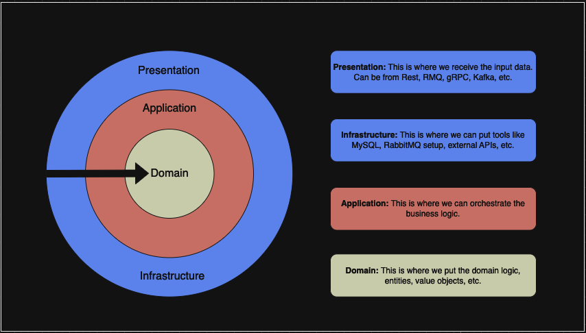

<p align="center">
    <h1 align="center">GO BOILERPLATE</h1>
</p>
<p align="center">
    <em>
    This is a boilerplate that you can use for your go projects :)
    </em>
</p>
<p align="center">
	<a href="https://opensource.org/licenses/MIT">
     
    </a>
    <a>
	 
    </a>
	<a href="https://github.com/diegoclair/go_boilerplate/actions">
     
    </a>
	<a href='https://goreportcard.com/badge/github.com/diegoclair/go_boilerplate'>
     
    </a>
<p>
<p align="center">
		<em>Developed with the software and tools below.</em>
</p>
<p align="center">
    
</p>
  
## Description ✈️
This project is a boilerplate for creating API projects in Go, incorporating key principles of Domain-Driven Design and Clean Architecture. It reflects my expertise in Golang, drawn from previous projects, and is structured to facilitate maintainability and scalability.

All layers of the codebase are tested to ensure reliability and robustness. The project is open to contributions and improvements. Feel free to fork the repository, submit pull requests, or open issues to discuss enhancements or report bugs.
  
### Project architecture:
<div align="center">
    
</div>

For the presentation layer, which I refer to as the transport layer, its purpose is to handle data transportation. It is responsible for receiving and responding to various types of requests, including API calls, gRPC, and messaging via RMQ, among others.

## ▶️ Getting Started 💻 

### ❗ First of all:
* You need to have docker installed in your computer.
* Run the command `chmod +x .docker/entrypoint.sh` to give permissions to execute the entrypoint file.

### Start ▶️
To start the applciation, you need just to run the command `docker-compose up`. When you see this message `your server started on [::]:5000` so your app is running correctly!

### 📝 Docs:
Inside of the `/docs` folder, you can see the Swagger documentation of the API Endpoints.

##  Contributing

Contributions are welcome! Here are several ways you can contribute:

- **Submit Pull Requests**: Review open PRs, and submit your own PRs.
- **[Join the Discussions](https://github.com/diegoclair/go_boilerplate/discussions)**: Share your insights, provide feedback, or ask questions.
- **[Report Issues](https://github.com/diegoclair/go_boilerplate/issues)**: Submit bugs found or log feature requests for Go_boilerplate.

<details closed>
    <summary>Contributing Guidelines</summary>

1. **Fork the Repository**: Start by forking the project repository to your GitHub account.
2. **Clone Locally**: Clone the forked repository to your local machine using a Git client.
   ```sh
   git clone https://github.com/<your_username>/go_boilerplate
   ```
3. **Create a New Branch**: Always work on a new branch, giving it a descriptive name.
   ```sh
   git checkout -b new-feature-x
   ```
4. **Make Your Changes**: Develop and test your changes locally.
5. **Commit Your Changes**: Commit with a clear message describing your updates.
   ```sh
   git commit -m 'Implemented new feature x.'
   ```
6. **Push to GitHub**: Push the changes to your forked repository.
   ```sh
   git push origin new-feature-x
   ```
7. **Submit a Pull Request**: Create a PR against the original project repository. Clearly describe the changes and their motivations.

Once your PR is reviewed and approved, it will be merged into the main branch.

</details>  

---

##  License

This project is protected under the [MIT License](https://choosealicense.com/licenses/mit/) License. For more details, refer to the [LICENSE](./LICENSE) file.

<br>
:bowtie:
